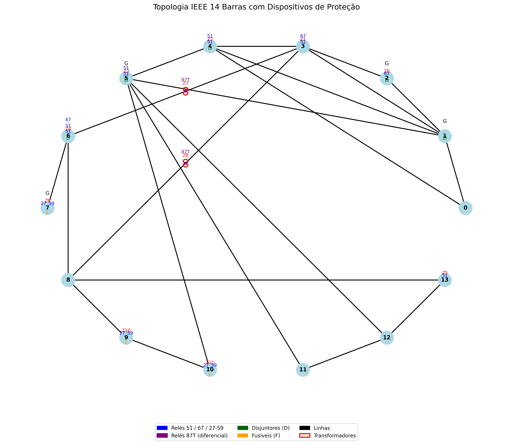

# PetroProtecAI Mini – Simulação do Projeto Petro_ProtecAI

Este projeto apresenta uma versão simplificada, porém tecnicamente estruturada, do Petro_ProtecAI, visando ilustrar o ciclo completo de desenvolvimento e integração entre Frontend, Backend, simulação elétrica com PandaPower, banco de dados PostgreSQL e CI/CD com GitHub Actions.

## 🎯 Objetivo

Simular um sistema de proteção elétrica com inserção de dispositivos e lógicas realistas em uma rede IEEE, com foco em:

- Coordenação de relés de sobrecorrente (ANSI 50/51) e diferenciais (87T);
- Simulação de faltas e avaliação da resposta do sistema;
- Desenvolvimento de algoritmo de RL para ajuste dinâmico dos parâmetros de proteção (pickup, TMS);
- Integração futura com API REST (FastAPI) e frontend (React);
- Preparação para aplicações industriais críticas (e.g., plataformas offshore), com elevada confiabilidade operacional exigida;
- Conformidade com normas técnicas como IEEE 242 e NBR 14039, que norteiam a proteção de sistemas elétricos industriais complexos.


## 📌 Contexto e Justificativa

O modelo IEEE 14 Barras é amplamente utilizado para estudos de fluxo de carga e estabilidade, mas não contempla dispositivos de proteção. Para tornar o modelo adequado à aplicação de algoritmos de proteção autônoma:
- Inserimos relés de sobrecorrente, relés direcionais, relés diferenciais e fusíveis simulados;
- Adicionamos disjuntores temporizados e transformadores com proteção dedicada;
- Dividimos a rede em zonas de proteção para facilitar o controle por RL.

### PandaPower em Projetos Complexos: Aplicabilidade e Limitações

O PandaPower é uma biblioteca Python voltada para análise de sistemas de potência, combinando a flexibilidade do Python com o poder computacional do PYPOWER. Apesar de sua popularidade em contextos acadêmicos, ele apresenta limitações importantes em projetos industriais complexos, especialmente na modelagem e coordenação de dispositivos de proteção:

- Não possui suporte nativo para relés ANSI/IEC com curvas normalizadas (50/51/67/81).
- Não permite simulação dinâmica de lógicas de coordenação seletiva.
- A modelagem de proteção deve ser feita de forma simplificada e assumida via código externo.

Portanto, seu uso neste projeto é exclusivamente voltado à prototipagem de estratégias e validação estática preliminar.

### Configuração de Relés no Sistema IEEE 14 Barras

**Ausência de Relés no Modelo Padrão:** O sistema IEEE 14 barras não inclui ativos de proteção como relés em sua modelagem padrão. A topologia é composta por 14 barras, 5 geradores, 11 cargas e 20 linhas, mas os dados são orientados a fluxo de potência e tensões, sem contemplar explicitamente elementos de proteção.

__Limitação:__ Isso dificulta a aplicação direta de algoritmos de RL para ajuste de relés. Para contornar:

- __Modelagem Adicional:__ Inserir relés sintéticos nas linhas e barras, com curvas de tempo inverso, corrente de pickup, e parâmetros extraídos de normas (ex.: IEEE C37.113).
- __Simulação de Falhas:__ Gerar cenários realistas de faltas e utilizar o PandaPower para observar a resposta da rede.

__Desafio Específico:__ A simplicidade topológica do IEEE 14 barras limita tanto a complexidade da coordenação quanto a representatividade para sistemas reais.

__Solução Proposta:__
- Adicionar relés fictícios e simular seu comportamento.
- Usar RL para otimizar os parâmetros (como TMS e pickup).
- Validar os resultados com ferramentas mais robustas como DIgSILENT PowerFactory ou Matpower.

### Implementação de RL com IEEE 14 Barras: Cuidados e Estratégia

Para implementar o algoritmo RL:
- Os relés serão simulados externamente.
- As ações serão ajustes contínuos (pickup, TMS).
- O ambiente de aprendizado modelará correntes de curto-circuito, tensões e resposta dos relés.

### Penalidades e Recompensas no RL

__Problemas Identificados:__
- Funções de recompensa mal calibradas não capturam bem os trade-offs entre seletividade, rapidez e confiabilidade.
- Penalidades genéricas resultam em exploração arriscada.
- Espaço de ação contínuo e amplo dificulta a convergência.

__Refinamentos Propostos:__
- __Recompensa Multiobjetivo:__
  - Seletividade: premiar atuação apenas do relé mais próximo.
  - Rapidez: tempo mínimo sem perder coordenação.
  - Estabilidade: manter variáveis do sistema dentro dos limites.

  Fórmula exemplo:
  ```bash
      R = w1*(1 - desvio_tensão) + w2*(1 - tempo_ação) - w3*disparo_indesejado
  ```

- __Penalidades Granulares:__
  ```bash
      P = -k1*(sobrecarga)^2 - k2*(desvio_tensão)^2 - k3*(falha_coordenação)
  ```

- __Exploração Controlada:__
  - Uso de PPO ou DDPG.
  - Restringir espaço de ação a limites realistas (ex: 0.5–2.0 pu).

- __Validação com Simulações:__
  - Testes com Matpower e PSS/E.
  - Ajustes iterativos na função de recompensa.

__Riscos e Cuidados:__
- Recompensas imprecisas podem priorizar rapidez em detrimento da seletividade.
- A convergência lenta pode comprometer a utilidade operacional.
- Começar com IEEE 14 barras e migrar para IEEE 39 após validação.

### Ferramentas utilizadas:

- __PandaPower__ para simulação de fluxo de potência e faltas.
- __Gymnasium__ como interface de ambiente RL customizado.
- __Stable-Baselines3__ com o algoritmo PPO (Proximal Policy Optimization), ideal para otimizações em espaços contínuos.

## ⚙️ Arquitetura Atual do Projeto

- simuladores/power_sim/gerar_ieee14_protecao_json.py → Gera o arquivo .json com a topologia modificada e os ativos de proteção.
- simuladores/power_sim/visualizar_topologia_protecao.py → Gera o diagrama elétrico com zonas de proteção e dispositivos.
- infra/protecao/protecao_eletrica.py → Define as classes de relés, suas lógicas de atuação e coordenação.
- main.py → Orquestra a simulação do sistema.
- run_tests.py → Roteia a execução automatizada dos testes unitários com pytest.
- tests/ → Contém os testes de unidade com integração ao CI/CD via GitHub Actions.
- simuladores/power_sim/gerar_ieee14_protecao_json.py → Gera o arquivo .json com a topologia modificada e os ativos de proteção.
- simuladores/power_sim/visualizar_topologia_protecao.py → Gera o diagrama elétrico com zonas de proteção e dispositivos.
- infra/protecao/protecao_eletrica.py → Define as classes de relés, suas lógicas de atuação e coordenação.
- main.py → Orquestra a simulação do sistema.
- tests/ → Contém testes automatizados (pytest) com pipeline CI/CD via GitHub Actions.

## 🚀 Estrutura do Projeto

```bash
.
├── infra/                         # Código-fonte de dispositivos de proteção (OO)
│   └── protecao/
│       └── protecao_eletrica.py
├── simuladores/                  # Simuladores baseados em pandapower
│   └── power_sim/
│       ├── scripts_simulacao.py
│       └── data/
│           └── ieee14.json
├── tests/                        # Testes automatizados (pytest)
│   ├── test_ieee14.py
│   ├── test_protecao_eletrica.py
│   └── test_simulacao.py
├── htmlcov/                      # Relatório HTML de cobertura de testes
├── src/                          # Aplicação web completa
│   ├── backend/
│   │   ├── database/
│   │   ├── api/
│   │   │   ├── routers/
│   │   │   └── services/
│   │   └── main.py
│   └── frontend/
│       └── petro-protecai-frontend/
│           ├── public/
│           └── src/
│               └── assets/
├── requirements.txt              # Dependências principais
├── requirements-dev.txt          # Dependências para testes e dev
├── docker-compose.yml
├── Dockerfile
└── README.md
```

## 🛠️ Tecnologias Utilizadas

- __Backend__: Python 3.12.5, FastAPI
- __Frontend__: React, TypeScript
- __Banco de Dados__: PostgreSQL
- __Simulador__: PandaPower (Rede IEEE 14 barras)
- __Aprendizado por Reforço__: Gymnasium, Stable-Baselines3
- __Infraestrutura__: Docker, Docker Compose
- __CI/CD__: GitHub Actions

## 🗃️ Configuração do Ambiente

### Requisitos
- Docker e Docker Compose
- Python 3.12.5
- Node.js (para frontend)

### Inicializando o ambiente

Clone o repositório:
```bash
    git clone <url_repositorio>
    cd petro_protecai_mini
```

Inicialize o backend e banco PostgreSQL:
```bash
    cd infra/
    docker-compose up --build
```

Frontend (instalar e rodar):
```bash
    cd frontend/
    npm install
    npm run dev
```

## ⚙️ Backend – FastAPI

O backend oferece endpoints REST para comunicação com a simulação.

### Estrutura Modular

- __api/main.py__ – ponto de entrada principal da API.
- __routers/__ – definição de rotas REST.
- __services/simulacao.py__ – lógica de negócio das simulações.
- __database/models.py__ – estrutura das tabelas com SQLAlchemy.

### Rodando localmente
```bash
    cd backend/
    uvicorn api.main:app --reload
```

Acesse documentação interativa: `http://localhost:8000/docs`

## 📊 Simulador – PandaPower

Utilizamos PandaPower com a rede IEEE 14 barras para demonstrar as capacidades de simulação e fluxo de potência.

Exemplo de execução:
```bash
    python simuladores/pandapower/scripts_simulacao.py
```

## 🌐 Frontend – React

Interface responsiva para interação e visualização dos resultados.

- Visualização gráfica dos resultados
- Entrada dinâmica de dados da rede elétrica

Rodando frontend:
```bash
    cd frontend/
    npm run dev
```
Acesse via: `http://localhost:3000`

## 📦 Docker

Infraestrutura local com Docker:
- PostgreSQL (armazenamento persistente)
- Backend FastAPI

Comandos úteis:
```bash
    docker-compose up --build  # inicializa todo ambiente
    docker-compose down        # encerra ambiente
```

## 🔄 Integração Contínua (CI/CD)

__GitHub Actions configurado para automação:__
- Testes unitários backend
- Build frontend/backend
- Deploy (futuro ambiente de staging)

Exemplo do workflow:
```yaml
    .github/workflows/ci_cd.yml
```

## 📁 Estrutura de Banco de Dados

__O PostgreSQL gerencia dados das simulações:__
- Dados de entrada das simulações
- Resultados armazenados para análise posterior

## 📌 Limitações do PandaPower

Este projeto é destinado a fins acadêmicos e demonstração, devido às limitações do PandaPower para aplicações industriais complexas, destacadamente nas áreas de proteção e coordenação seletiva (ANSI/IEC 50/51/67/81).

## 🧪 Testes

Execute testes automatizados com Pytest:
```bash
    cd tests/
    pytest
```

## 🎯 Instalando bibliotecas

```bash
# Instalar dependências de produção
    pip install -r requirements.txt

# Instalar dependências de desenvolvimento
    pip install -r requirements-dev.txt

```

## 🧪 Testes Automatizados e Cobertura

Todos os testes são executados com `pytest`, com cobertura gerada por `coverage.py`.

```bash
    pytest --cov=infra.protecao --cov-report=html tests/
```

__O relatório é gerado em:__  
```bash
    htmlcov/index.html
```

### Interpretação das Porcentagens de Cobertura

- As porcentagens mostradas ao lado de cada arquivo de teste refletem __quanto do pacote `infra.protecao` foi coberto por aquele arquivo especificamente__.
- Elas __não representam falha__, mas apenas o impacto individual daquele teste na cobertura global.

__Exemplo:__
```bash
    tests/test_ieee14.py .......... [ 20% ]   # Cobre apenas indiretamente parte de infra.protecao
```

> A cobertura total final do projeto é apresentada no `index.html` e deve atingir **100%** se todos os módulos estiverem bem cobertos.

---

## 🚀 Execução Local

### Simulação Elétrica (IEEE 14 Barras)
```bash
    python main.py
```

### Backend (FastAPI)
```bash
    cd src/backend
    uvicorn main:app --reload
```

### Frontend (React)
```bash
    cd src/frontend/petro-protecai-frontend
    npm install
    npm run dev
```

---
## 🔌 Topologia e Estratégia de Proteção Inicial (t = 0)

## Visão Geral

O projeto __ProtecAI_mini__ é uma versão reduzida e controlada da rede IEEE 14 Barras, projetada para validar estratégias iniciais de proteção, coordenação e atuação de dispositivos como relés, disjuntores e transformadores. Esta versão serve como base para o desenvolvimento incremental da solução __ProtecAI__, voltada para aplicações críticas, como sistemas de proteção elétrica em plataformas offshore.

## Objetivos

- Modelar uma topologia mínima porém funcional.
- Inserir dispositivos de proteção estrategicamente.
- Visualizar e validar a atuação coordenada dos dispositivos.
- Preparar a estrutura para testes com algoritmos inteligentes de proteção.
- Simular falhas e avaliar a resposta dos dispositivos de proteção.


## ⚠️ Nota sobre a Topologia Minimalista

A rede modelada representa uma __versão simplificada e experimental__ da topologia IEEE 14 Barras. Foram inseridos relés, disjuntores e transformadores de forma __estratégica__ nas __barras 1 a 8__, com o intuito de validar a lógica de atuação da proteção em um ambiente controlado.

> ❗ **Importante**: Este modelo não cobre toda a malha da rede IEEE 14. O objetivo é simular um subconjunto funcional e permitir a evolução modular e validada do projeto.

### Justificativa para a Cobertura Parcial

__Essa decisão visa:__
- Reduzir a complexidade inicial.
- Acelerar os testes de lógica de proteção.
- Facilitar a validação visual e automatizada.
- Permitir a futura expansão gradual para os demais ativos.

A rede modelada representa __uma versão reduzida e controlada__ da topologia IEEE 14 Barras. Foram inseridos relés e disjuntores apenas nas __barras 1 a 8__, de forma estratégica, com foco na __validação inicial de algoritmos de proteção__.

Essa decisão visa simplificar a visualização e facilitar a identificação de falhas, mantendo a rede funcional, porém __parcialmente protegida__. Os demais elementos (barras 9–13, trafos e parte das cargas) __ainda não estão cobertos por dispositivos de proteção__, e serão incorporados em etapas futuras do projeto.

Portanto, este modelo é chamado **ProtecAI_mini** e serve como **primeira etapa experimental** para o desenvolvimento e avaliação da lógica de coordenação inteligente.

## Tabelas de Dispositivos de Proteção – Projeto ProtecAI_MINI

### Descrição Geral dos Dispositivos

| Tipo de Dispositivo          | Função                                                | Locais Sugeridos                      |
| ---------------------------- | ----------------------------------------------------- | ------------------------------------- |
| Relé 50/51 (Sobrecorrente)   | Proteção de feeders e linhas                          | Barras 3–4, 4–5, 5–6, 6–13            |
| Relé 67 (Direcional)         | Evita disparos indevidos em fluxos reversos           | Barras próximas a geradores (2, 3, 6) |
| Relé 87T (Diferencial)       | Proteção de transformadores                           | Barras 2–4, 4–5 (conexões G e T)      |
| Relé 27/59 (Sub/Sobretensão) | Proteção de cargas sensíveis ou controle de qualidade | Barras 7, 9, 10, 14                   |
| Disjuntores (com tempo)      | Abertura física do circuito após atuação dos relés    | Saídas de transformadores e geradores |
| Fusíveis (simulados)         | Proteção passiva para ramais menores                  | Barras 12, 13, 14                     |
| Transformadores (2 unid.)    | Transformadores a óleo de 25 MVA                      | Entre barras 1–5 e 2–6                |

### Elementos Presentes na Rede

| Elemento        | Total na rede | Protegido? | Observação                                         |
| --------------- | ------------- | ---------- | -------------------------------------------------- |
| Barras          | 14            | Sim        | Todas as barras recebem pelo menos um dispositivo  |
| Linhas          | 20            | Parcial    | Protegidas por relés 50/51 e disjuntores           |
| Transformadores | 2             | Sim        | Protegidos por relés 87T e disjuntores             |
| Relés 50/51     | 4             | Sim        | Instalação nos ramos críticos                      |
| Relés 67        | 2             | Sim        | Próximos aos geradores para evitar fluxos reversos |
| Relés 87T       | 2             | Sim        | Localizados nos terminais dos transformadores      |
| Relés 27/59     | 3             | Sim        | Conectados a cargas sensíveis                      |
| Disjuntores     | 4             | Sim        | Acoplados a relés nas saídas de T e G              |
| Fusíveis        | 3             | Simulado   | Nos ramais com menor criticidade                   |


## 🧩 Dispositivos Modelados

| Tipo de Dispositivo          | Função                                               | Locais Sugeridos                      |
| ---------------------------- | ---------------------------------------------------- | ------------------------------------- |
| Relé 50/51 (Sobrecorrente)   | Proteção de linhas e alimentadores                   | Barras 3–4, 4–5, 5–6, 6–13            |
| Relé 67 (Direcional)         | Evita atuação indevida em fluxos reversos            | Barras próximas a geradores (2, 3, 6) |
| Relé 87T (Diferencial)       | Proteção de transformadores                          | Barras 2–4, 4–5                       |
| Relé 27/59 (Sub/Sobretensão) | Proteção de cargas sensíveis e controle de qualidade | Barras 7, 9, 10, 14                   |
| Disjuntores temporizados     | Interrupção de circuitos sob comando de relés        | Saídas de transformadores e geradores |
| Fusíveis simulados           | Proteção rápida e isolada                            | Cargas menores, terminais             |

> 📌 ___Nota___: A modelagem parcial dos transformadores foi realizada na Etapa 0. Relés diferenciais (87T) ainda serão adicionados para proteção completa.
> 
---

## Dispositivos de Proteção Inseridos

- __Relés (vermelho)__: instalados nas barras 1, 2, 3 e 4.
- __Disjuntores (azul)__: instalados nas barras 5, 6, 7 e 8.
- __Transformadores (roxo)__: adicionados entre as barras 1–5 e 2–6.

__Esses dispositivos formam a base do sistema de proteção automatizado e serão expandidos para cobrir toda a malha.__                |

_Estes dispositivos atuam como base de teste para a futura implementação da coordenação de proteção automatizada._

---

## 🗺️ Topologia Atual (com Proteção)


O sistema está dividido em 11 zonas de proteção:
- 2 zonas diferenciais (Z12 e Z13);
- 9 zonas de barras com relés e disjuntores associados.

As zonas foram definidas com base na localização dos transformadores, geradores e cargas críticas. As zonas diferenciais foram aplicadas nos trechos com transformadores acoplados, enquanto as zonas de barra cobrem trechos da rede com múltiplas conexões e maior complexidade de manobra. A segmentação visa garantir seletividade, proteção coordenada e a viabilidade de controle por RL.

As zonas foram validadas e mantêm seletividade topológica.

---

### ✔️ Visualização da Rede IEEE14 Barras com os ativos



__Este projeto implementa uma versão inicial do sistema IEEE 14 Barras__ com elementos de proteção modelados explicitamente para testes e desenvolvimento de algoritmos inteligentes de coordenação de proteção. A rede foi estendida com a inserção de __relés__, __disjuntores__, __cargas__, __geradores__, __ext_grids__ e __transformadores__, associados a barras específicas da topologia original.

A topologia protegida pode ser visualizada executando o script:

```bash
    python simuladores/power_sim/visualizar_topologia_protecao.py
```

__Legenda de Cores do Diagrama:__

- 🔵 __Relés 51 / 67 / 27-59__ → `blue`
- 🟣 __Relés 87T (diferencial)__ → `purple`
- 🟢 __Disjuntores (D)__ → `darkgreen`
- 🟠 __Fusíveis (F)__ → `orange`
- ⚫ __Linhas__ → `black`

---
__Tipos de falhas a serem simuladas:__

- Curto-circuito monofásico, bifásico e trifásico.
- Falhas fase-terra.
- Falhas em transformadores (sobreaquecimento, curto interno).
- Desconexão súbita de carga ou geração.

__Localização das falhas:__

- Em barras específicas (ex.: barra 3 com carga crítica).
- Em linhas de interligação entre barras.
- Em transformadores ou nas extremidades do sistema.

__Parâmetros das falhas:__

- Intensidade (resistência de falta).
- Tempo de início e duração.
- Probabilidade de ocorrência (para testes de robustez).

__Objetivo da simulação:__

- Avaliar a atuação dos relés e disjuntores atuais.
- Verificar tempo de atuação e alcance de proteção.
- Registrar os casos em que a proteção falha ou atua incorretamente.

__Estrutura esperada (a projetar):__

Um módulo `gerador_defeitos.py` com funções como:

```python
    def simular_curto_circuito(barra: int, tipo: str, tempo: float):
        pass

    def injetar_falha_trafo(id_trafo: int):
        pass

    def avaliar_atuacao_protecao(defeito_id: str):
        pass
```

Este projeto de simulação será validado manualmente na versão ProtecAI_mini, e posteriormente adaptado para orquestração automatizada por algoritmos de Aprendizado por Reforço (RL).

---

> Versão atual: __ProtecAI_mini v0.4__ – Topologia parcialmente protegida com inclusão de transformadores, visão estratégica para ambientes offshore e foco em falhas críticas como as de transformadores.

---
### Etapa 0 – Correções de Infraestrutura

- Inclusão explícita de transformadores reais usando `pp.create_transformer`.
- Atualização do arquivo `ieee14_protecao.json` para refletir corretamente os ativos e suas conexões.
- Ajuste da topologia visual para representar de forma realista os elementos da rede.
- Refatoração dos scripts:
  - `scripts_simulacao.py`
  - `config_protecao.py`
  - `visualizar_topologia_protecao.py`
  - Scripts de teste automatizado em `tests/`

### Etapa 1 – Projeto de Geração de Defeitos/Falhas

Antes da implementação, será formalizado o projeto para geração e simulação de defeitos na rede. Os aspectos considerados incluem:

__Tipos de falhas a serem simuladas:__

- Curto-circuito monofásico, bifásico e trifásico.
- Falhas fase-terra.
- Falhas em transformadores (sobreaquecimento, curto interno).
- Desconexão súbita de carga ou geração.

__Localização das falhas:__

- Em barras específicas (ex.: barra 3 com carga crítica).
- Em linhas de interligação entre barras.
- Em transformadores ou nas extremidades do sistema.

__Parâmetros das falhas:__

- Intensidade (resistência de falta).
- Tempo de início e duração.
- Probabilidade de ocorrência (para testes de robustez).

__Objetivo da simulação:__

- Avaliar a atuação dos relés e disjuntores atuais.
- Verificar tempo de atuação e alcance de proteção.
- Registrar os casos em que a proteção falha ou atua incorretamente.

__Estrutura esperada (a projetar):__

Um módulo `gerador_defeitos.py` com funções como:

```python
    def simular_curto_circuito(barra: int, tipo: str, tempo: float):
        pass

    def injetar_falha_trafo(id_trafo: int):
        pass

    def avaliar_atuacao_protecao(defeito_id: str):
        pass
```

Este projeto de simulação será validado manualmente na versão __ProtecAI_mini__, e posteriormente adaptado para orquestração automatizada por algoritmos de Aprendizado por Reforço (RL).

---

> Versão atual: __ProtecAI_mini v0.4__ – Topologia parcialmente protegida com inclusão de transformadores, visão estratégica para ambientes offshore e foco em falhas críticas como as de transformadores.

---

### ⚙️ Ativos de Proteção

- __Relés (vermelho) – Barras 1 a 4__
  - Tipo: Relés de sobrecorrente (51/50).
  - Função: Detectar correntes anômalas nos ramos associados às barras principais.
  - Protegem: Cargas e disjuntores conectados às barras locais. São os primeiros sensores de falha.
  - Papel na Coordenação: Disparam sinais de alarme e abrem os disjuntores correspondentes quando há sobrecorrente, iniciando a atuação da lógica de coordenação.

- __Disjuntores (azul) – Barras 5 a 8__
  - Tipo: Disjuntores automáticos coordenados com os relés.
  - Função: Interromper fisicamente o fluxo de corrente em caso de falha detectada.
  - Protegem: Ramos críticos interligando áreas de carga e geração.
  - Papel na Coordenação: Atuam sob comando dos relés correspondentes, abrindo circuitos de forma seletiva.

- __Cargas (verde)__
  - Localização: Barras com `net.load`.
  - Função: Representam os pontos de consumo da rede.
  - Papel na Coordenação: São elementos a serem preservados. A lógica de proteção visa minimizar sua desconexão em situações de falha.

- __Geradores (laranja)__
  - Localização: Barras com `net.gen`.
  - Função: Fontes locais de geração de energia.
  - Papel na Coordenação: Devem ser protegidos contra sobrecarga e curtos a jusante, sendo prioritário manter sua contribuição energética em operação estável.

- __Ext_grid (preto)__
  - Localização: Barra de fronteira com a rede principal.
  - Função: Representa o ponto de conexão com o sistema elétrico externo.
  - Papel na Coordenação: Permanece sempre energizado; a lógica de proteção evita seu desligamento exceto em situações críticas.

- __Transformadores (roxo)__
  - Localização: Conectados entre duas barras via `net.trafo`.
  - Função: Alterar níveis de tensão entre áreas da rede.
  - Papel na Coordenação: São monitorados passivamente na versão atual, mas em versões futuras poderão ter relés diferenciais (87T).
---

### 🧠 Coordenação Inicial da Proteção (Instante t = 0)

No tempo inicial (antes de qualquer falha simulada), a rede encontra-se __completamente energizada__, todos os relés e disjuntores __em modo de espera__, e os seguintes princípios de coordenação foram adotados:

- Cada __relé__ monitora correntes nas barras 1 a 4 e decide com base em limiares fixos se há anomalia.
- Cada __relé está logicamente vinculado a um disjuntor específico__:
  - Relé da barra 1 → Disjuntor da barra 5
  - Relé da barra 2 → Disjuntor da barra 6
  - Relé da barra 3 → Disjuntor da barra 7
  - Relé da barra 4 → Disjuntor da barra 8
- A __atuação ocorre em cascata__, priorizando a seletividade:
  - Primeiro atua o relé mais próximo da falha.
  - Se a falha persistir, relés a montante assumem a proteção.
- __Não há falhas em t = 0__, portanto todos os dispositivos permanecem conectados.

___Esta topologia base será utilizada para aplicação de falhas controladas e análise de desempenho da coordenação automática com algoritmos de aprendizado por reforço em fases posteriores.___

---

## ✅ Status Atual
- [x] Modelagem OO de proteção elétrica (Rele51, Rele27, etc)
- [x] Simulação IEEE 14 Barras com pandapower
- [x] Testes unitários com cobertura
- [x] Backend funcional com FastAPI
- [x] Frontend funcional com React + Tailwind
- [x] CI/CD com GitHub Actions

---

🔁 Etapas em Andamento e Futuras (versão refatorada)
md
Copiar
Editar
## 🔁 Etapas em Andamento e Futuras

- [x] Modelagem dos dispositivos e zonas de proteção;
- [x] Visualização da topologia com `matplotlib` (layout validado);
- [x] Integração contínua (CI/CD) com GitHub Actions e testes automatizados (`pytest`);
- [ ] Geração automatizada de faltas elétricas em pontos críticos da rede;
- [ ] Testes unitários e de integração por tipo de dispositivo de proteção (relé, disjuntor, fusível);
- [ ] Desenvolvimento e integração do ambiente de Aprendizado por Reforço (RL);
- [ ] Implementação da lógica de penalidade e recompensa baseada em seletividade e estabilidade;
- [ ] Construção de API REST com FastAPI e painel frontend com React;
- [ ] Validação de desempenho do sistema com métricas industriais (tempo de resposta, taxa de falhas, blackout evitado).
🧠 Estratégia de RL (versão expandida)
md
Copiar
Editar
## 🧠 Estratégia de RL (Planejada)

- __Estado:__ Vetores representando corrente por barra, tensão por zona, tempo de atuação dos relés, e estado dos disjuntores;
- __Ação:__ Ajustes contínuos dos parâmetros de proteção (ex: corrente de pickup, TMS, tempo de atuação);
- __Recompensas:__ Concessão de pontos para ações que:
  - Garantem seletividade de atuação;
  - Minimiza tempo de falta;
  - Evitam desligamento de cargas críticas;
  - Restabelecem a operação segura;
- __Penalidades:__ Redução de pontos em cenários como:
  - Blackout total ou parcial;
  - Atuação incorreta ou tardia de relé;
  - Abertura de disjuntor em zona não-faltosa;
  - Infringência de limites operacionais definidos por norma (IEEE 242, NBR 14039).

---

## 📄 Documentação

Documentos adicionais:
- `docs/Stro_ProtecAI_Mini.docx`
- `docs/Metro_ProtecAI_Mini.docx`

---

## 👥 Contato

Eng. de Sistemas: Prof. Angelo Cesar Colombini  
Universidade Federal Fluminense – UFF

---

## 🧠 Observação Final

Este projeto segue princípios profissionais de Engenharia de Software: separação de responsabilidades, testes automatizados, modularidade e pipeline de entrega. Ele serve como base para expansão futura com controle adaptativo, lógicas de seleção e redes maiores.

## 🎯 Roadmap futuro

- Implementação de autenticação JWT
- Deploy em ambiente de staging
- Expansão das simulações com novos cenários
- Melhoria contínua da documentação

_Este README será atualizado conforme as novas versões forem sendo implementadas._

## 📄 Contribuição

- Crie uma nova branch para suas alterações
- Realize Pull Request descrevendo claramente as modificações

## 📌 Licença

Este projeto é distribuído sob a licença MIT.

---

Desenvolvido por: Equipe Petro_ProtecAI Mini 🚀
